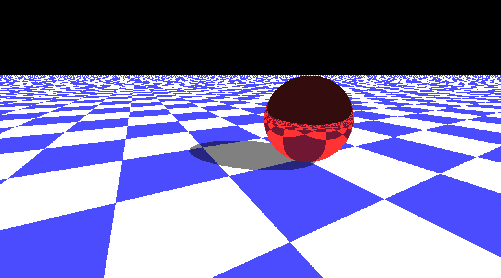

# Simple OpenGL raytracer.
This is a simple raytracer built with C++, OpenGL, and using the GLFW and GLEW libraries.



This demo contains a single reflective red sphere on an infinite checkered plane. One bounce after the initial ray collision is simulation to facilitate reflection and hard shadows. This demo runs at a 720p resolution, however this can be changed by editing the ```ENGINE_WIDTH``` and ```ENGINE_HEIGHT``` macros in ```renderer.cpp```, as well as updating the uniform variables passed to the shader in ```main.cpp```.

I may update this raytracer in the future with more features, however don't consider this project to be in active development. It's just intended as a simple exercise to flex my graphics programming knowledge.